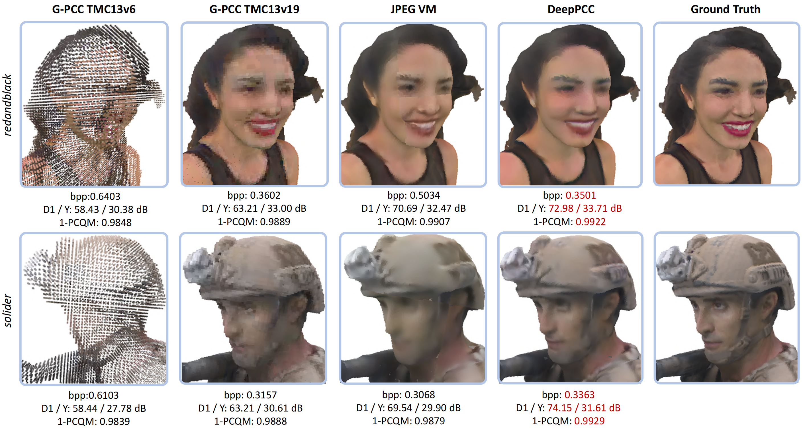
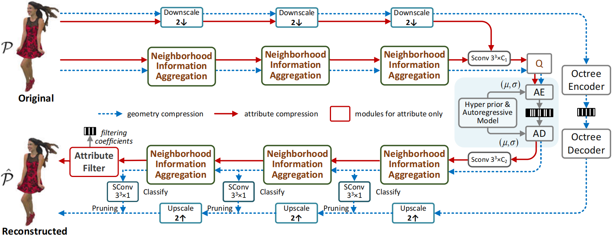

# DeepPCC: Learned Lossy Point Cloud Compression

**Abstract — ** We propose DeepPCC, an end-to-end learning-based approach for the lossy compression of large-scale object point clouds. For both geometry and attribute components, we introduce the Multiscale Neighborhood Information Aggregation (NIA) mechanism, which applies resolution downscaling progressively (*i.e.*, dyadic downsampling of geometry and average pooling of attribute) and combines sparse convolution and local self-attention at each resolution scale for effective feature representation. Under a simple autoencoder structure, scale-wise NIA blocks are stacked as the analysis and synthesis transform in the encoder-decoder pair to best characterize spatial neighbors for accurate approximation of geometry occupancy probability and attribute intensity. Experiments demonstrate that DeepPCC remarkably outperforms stateof-the-art rules-based MPEG G-PCC and learning-based solutions both quantitatively and qualitatively, providing strong evidence that DeepPCC is a promising solution for emerging AI-based PCC. 


## News

* 2025.01.10 **Open source DeepPCC !**
* 2024.10.11 DeepPCC was accepted by TETCI. (https://ieeexplore.ieee.org/document/10714474)

### Examples



### Method



## Environment

- pytorch **1.10**
- MinkowskiEngine 0.54
- h5py
- open3d
- pytorch3d
- Training Dataset: ShapeNet 

* You can use docker to simply configure the environment: `docker pull jianqiang1995/pytorch:1.10.0-cuda11.1-cudnn8-devel`


## Dataset

* **ShapeNet**: https://shapenet.org/ 
* **RWTT**: https://texturedmesh.isti.cnr.it/ 
* **MPEG Dataset (Static Objects)**: http://mpegfs.int-evry.fr/MPEG/PCC/DataSets/pointCloud/CfP/datasets/ (MPEG password is required) 

## Testing

### DeepPCGC

```python
python test.py --filedir='TEST/8iVFB' --outdir='output/test' --resultdir='results/test' --hyper (optional --pct_pos for test R01)
```

### DeepPCAC

```python
python test_losslessG_lossyA.py --input_rootdir='TEST/8iVFB' (optional --quick for quick test not encoding & decoding)
```

### DeepPCC

Joint DeepPCGC & DeepPCAC

Need test DeepPCGC first,

```python
python test.py --filedir='TEST/8iVFB' --outdir='output/test' --resultdir='results/test' --hyper (optional --pct_pos for test R01)
```

then,

```python
python test_lossyG_lossyA.py --input_rootdir='TEST/8iVFB' --lossyGeo_rootdir='output/test' (optional --quick for quick test not encoding & decoding)
```

Adjust the paths of different pre-trained models to test various compression rates. ```ckptsdir_list = ['./pretrained/r04.pth']```  or ``` ckptsdir_list = ['./pretrained/r01.pth', './pretrained/r02.pth', './pretrained/r03.pth', './pretrained/r04.pth']```

## Results

The results of the paper are located in `./results`.

## Authors

These files are provided by Hangzhou Normal University [IVC Lab](https://github.com/3dpcc/3DPCC) and Nanjing University [Vision Lab](https://vision.nju.edu.cn/).  Please contact us (zhangjunzhe@stu.hznu.edu.cn, DandanDing@hznu.edu.cn and mazhan@nju.edu.cn) if you have any questions.
